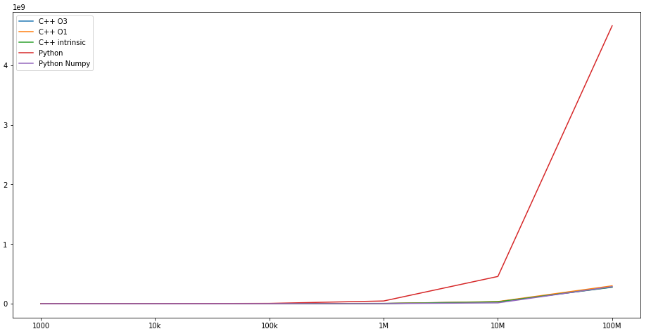
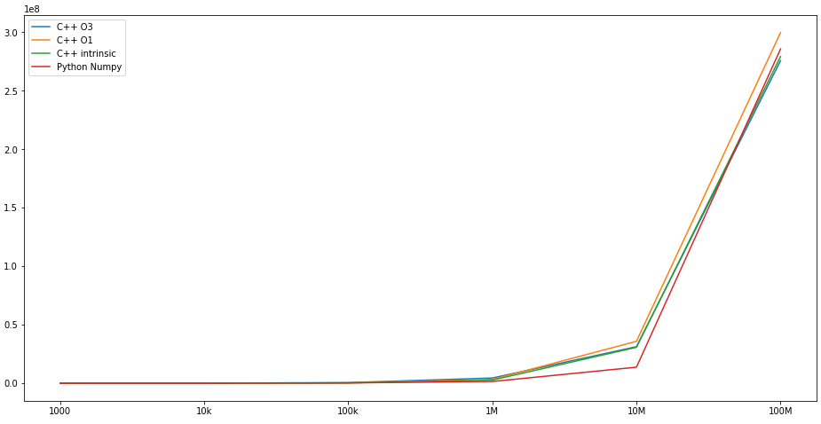

# Second Homework Report


## Overview
In this homework I've implemented pairwise multiplication of arrays and measured time it took for the programs to run.

## Measurements Table

```

           C++ O3       C++ O1  C++ intrinsic        Python  Python Numpy
1000       3030.0       1780.0         1670.0  4.946000e+04        6860.0
10k       68430.0      27040.0        29229.0  4.531970e+05       23540.0
100k     524357.0     288458.0       272839.0  4.633655e+06      267899.0
1M      4464160.0    3236450.0      2705840.0  4.537916e+07     1482212.0
10M    31228500.0   35826800.0     30671300.0  4.569555e+08    13715858.0
100M  275726000.0  299732000.0    279184000.0  4.662012e+09   285696619.0
```

Execution time in nanoseconds.

## Plots



1) Comparison of all implementations.



2) Native Python implementation excluded.

## Conclusions

Results that I've got was expected to me, however it was surprising to see that `numpy` version for arrays sizes less then 10 millions is faster then C++ version.  
I have suggestion that the reason for it is that under the hood `numpy` uses some efficient Fortran code.
